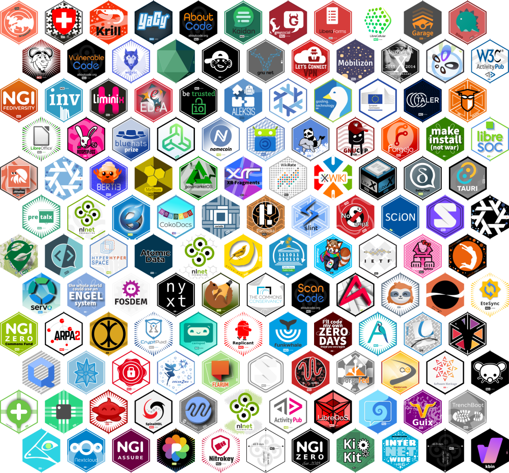
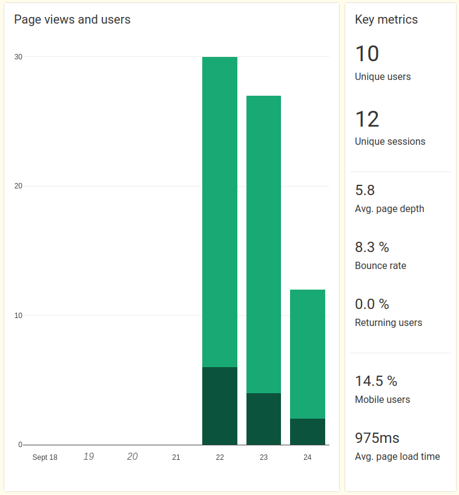
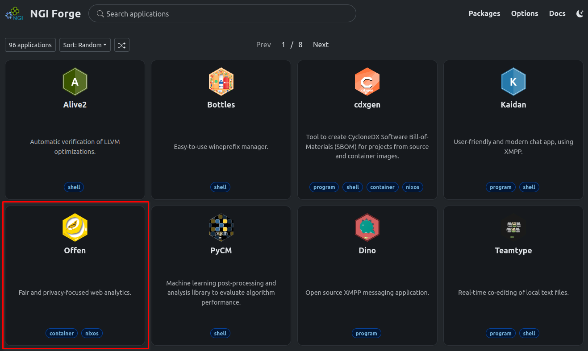
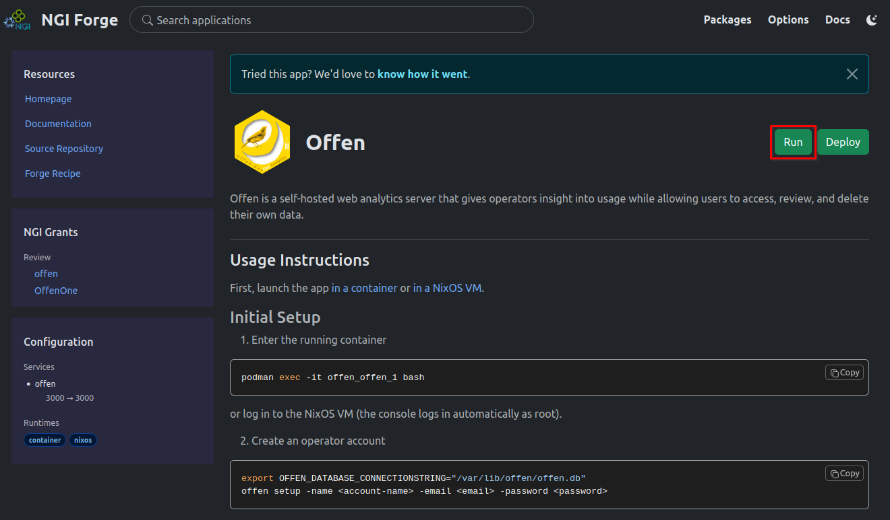
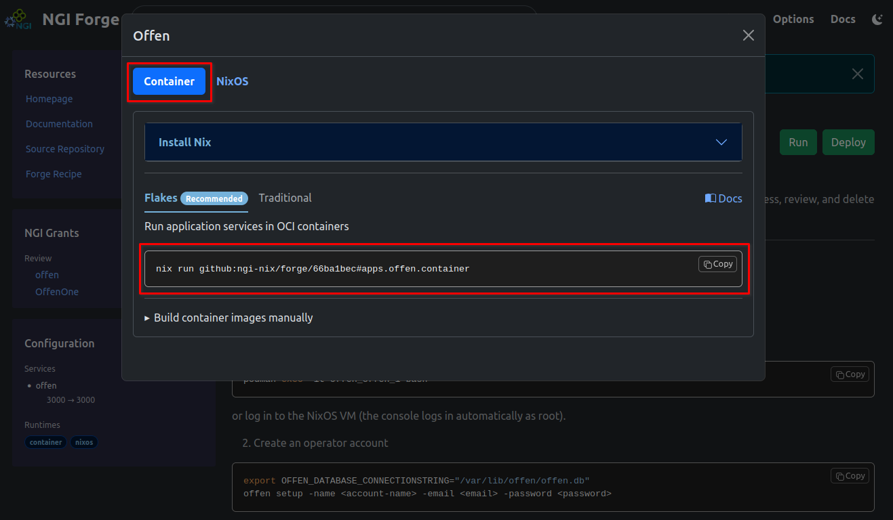
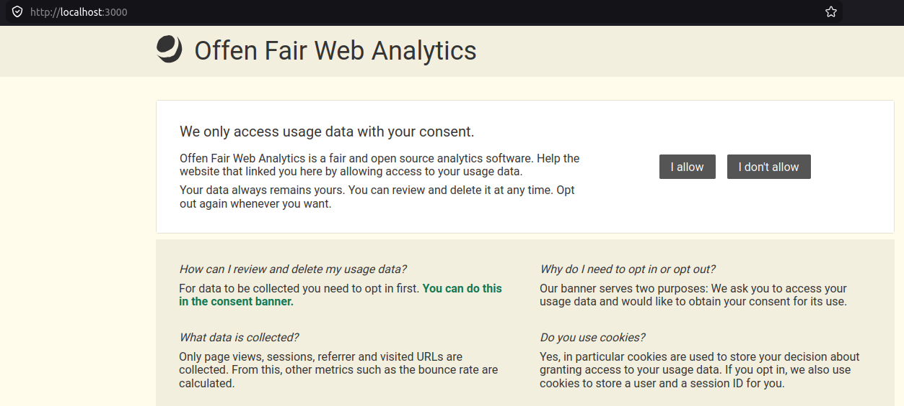
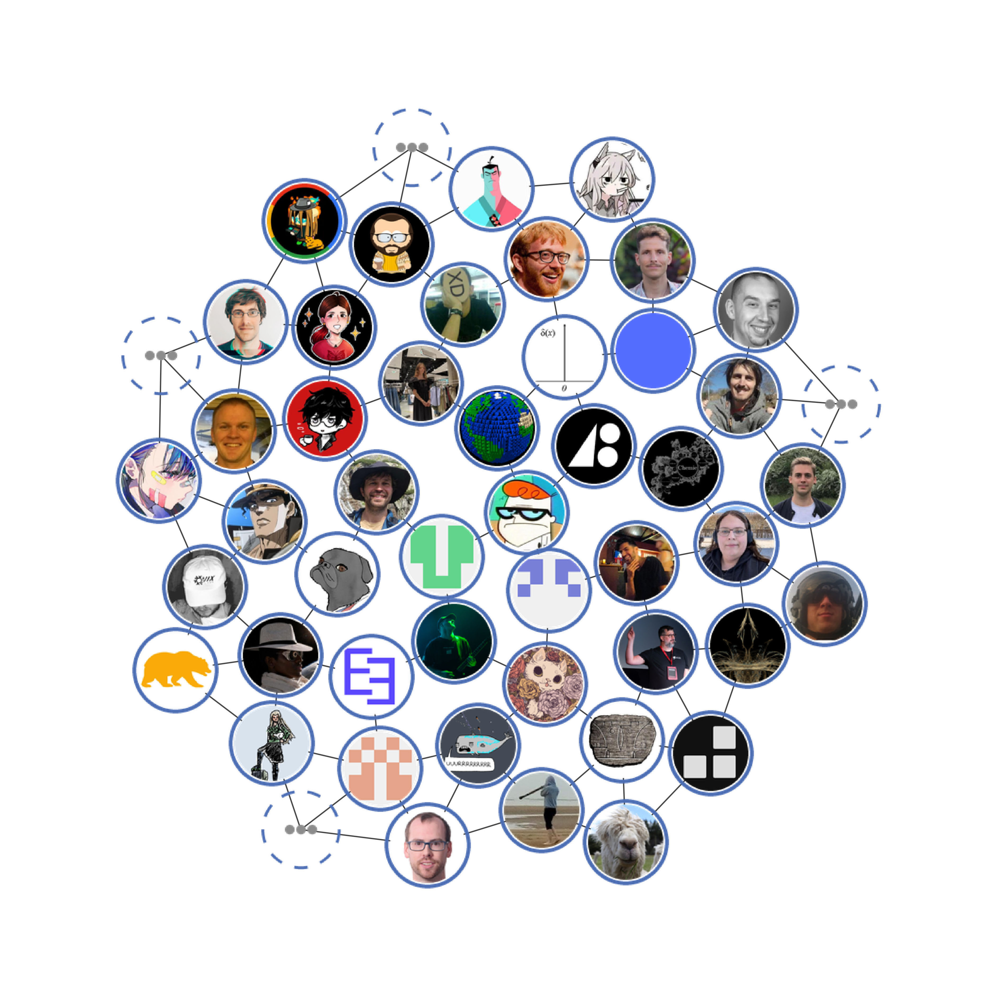
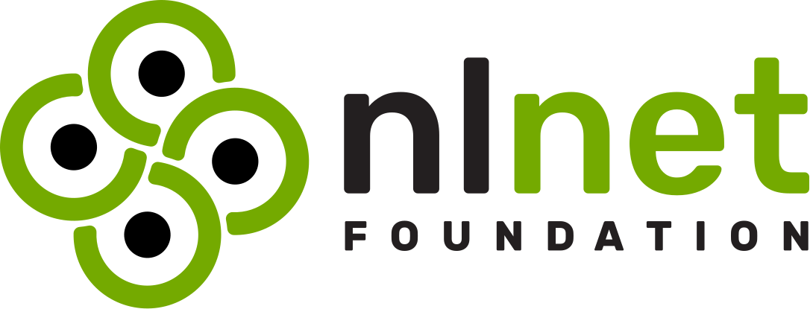

# NGI Team @ NixOS Foundation

---

### NixOS Foundation

NGI Zero **consortium member**

**Nix, Nixpkgs, NixOS**


https://nixos.org/

---

### NGI Team @ NixOS Foundation

<div style="display: flex; align-items: center; gap: 30px;">
<div style="width: 500px;">

</div>

<div style="text-align: left;">

* **Packaging** and **maintenance** of **NGI-funded projects** with Nix

* Organizing **Summer of Nix** (2021 - 2026 - 2030)

</div>
</div>

https://nixos.org/community/teams/ngi/

---

## Our Challenges

---

### #1
**How to package** 1000+ projects with varying complexity, maturity, and ecosystem support?

---

### #2
**How to** sustainably **maintain** 1000+ projects?

---

## The Idea

---


**Distribute** the packaging and maintenance effort

---

## NGI Forge



Note:
Forge development has started in Feb 2026

---

### Key Design Principles

* Make packaging of software **intuitive**

* Provide **attractive additional benefits** for contributors

* Target **wide range (also non-Nix) of users**

* **Gradually expose** users/contributors to the super-powers of Nix

---


### Contributor interface

---

#### Offen - Fair Web Analytics

<div style="display: flex; align-items: center; gap: 30px;">
<div style="width: 600px;">

</div>

<div style="text-align: left;">

* 55 % Javascript + 40 % Go

* NGI0 PET 2019 - 2019
* NGI0 Discovery 2020 - 2022

* https://github.com/offen/offen

</div>
</div>

---

#### Packages

```nix [1,18|2-5,1,18|7-10,1,18|12-17,1,18]
  pkgs.offen = {
    version = "1.4.2-unstable-2026-06-11";
    description = "Fair and privacy-focused web analytics.";
    homePage = "https://www.offen.dev";
    mainProgram = "offen";

    source = {
      git = "github:offen/offen/ec99082a37ffb5855bd84debfef227d41c7b403c";
      hash = "sha256-EGlqD3611sG3YTVe74H49PB8Hj1NsKYhLANg5VAQ0wg=";
    };

    build.goPackageBuilder = {
      enable = true;
      vendorHash = "sha256-AeQa5oaOEB/50aPCRq702vMEtEctwP+jU5C6zB+3XR0=";
      ldflags = [ "-s" "-w" ];
      modRoot = "server";
    };
  };
```
`recipes/pkgs/offen/recipe.nix`

---

#### Applications

```nix [1,27|2-11,1,27|13-20,1,27|22-26,1,27]
  apps.offen = {
    displayName = "Offen";
    description = "Fair and privacy-focused web analytics.";
    longDescription = ''
      Offen is a self-hosted web analytics server that gives operators insight
      into usage while allowing users to access, review, and delete their own
      data.
    '';
    usage = ''
      ...
    ''

    services = {
      components.offen = {
        process.command = pkgs.offen;  # <-- Forge package
        process.argv = [ "serve" ];
        process.environment = {
          OFFEN_SERVER_PORT = "3000";
        };
      };

      runtimes = {
        container.enable = true;
        nixos.enable = true;
      };
    };
  };
```
`recipes/apps/offen/recipe.nix`

---


### Web user interface

---

#### NGI applications catalogue



https://ngi.nixos.org/

---

#### Offen



---

#### Run offen in container



---

#### Run offen in container

```plaintext [1|3-9]
nix run github:ngi-nix/forge/f00365b4#apps.offen.container

Creating container image /home/imincik/.cache/ngi-forge/e70cdb81/offen-offen-j3g9by1lj3mk3p9yclhzpbx15y9y36rr.tar ... done.
Loaded image: localhost/offen-offen:j3g9by1lj3mk3p9yclhzpbx15y9y36rr

[offen] | [2026-09-03T09:36:59Z INFO  nimi::cli] Launching process manager...
[offen] | [2026-09-03T09:36:59Z INFO  nimi::process_manager] Starting process manager...
[offen] | [2026-09-03T09:36:59Z INFO  offen] Running: /nix/store/hglbmavg7kjvpv36yy247dzms37xk53h-offen-1.4.2-unstable-2026-06-11/bin/offen serve
```



---

### Nixpkgs


</br>
</br>

The largest software repository in the world

\> 300 packages maintained by NGI Team

Note:
* NGI software is either packaged in NGI Forge or in Nixpkgs
* Nixpkgs packages are re-exported as Forge apps

---

## Thank you

<div style="display: flex; align-items: center; gap: 10px;">
<div style="width: 700px;">

</div>

<div style="display: flex; flex-direction: column; align-items: flex-start;">





</div>
</div>

https://ngi.nixos.org/
