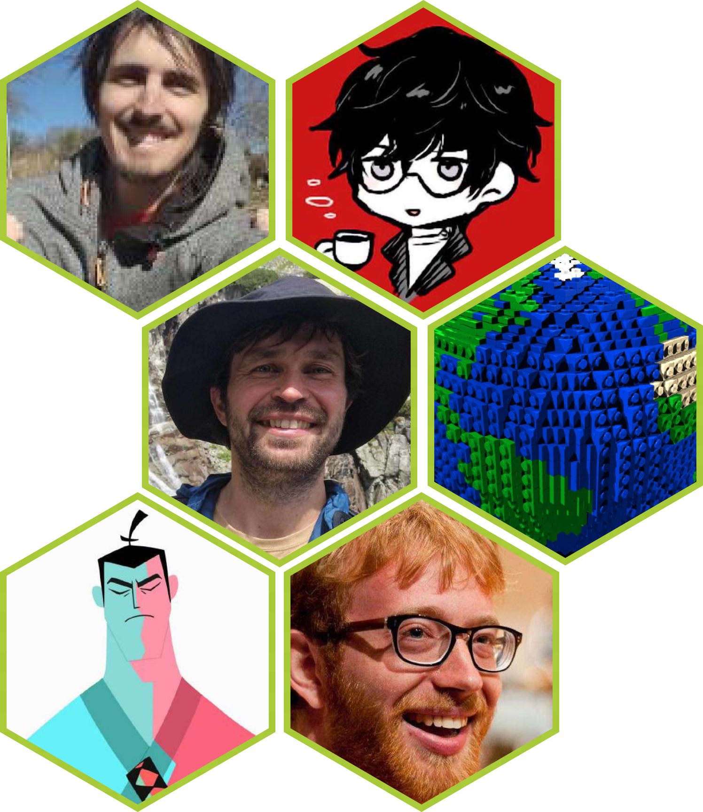
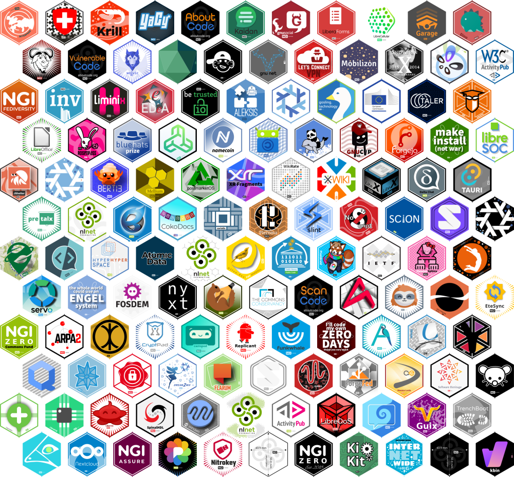
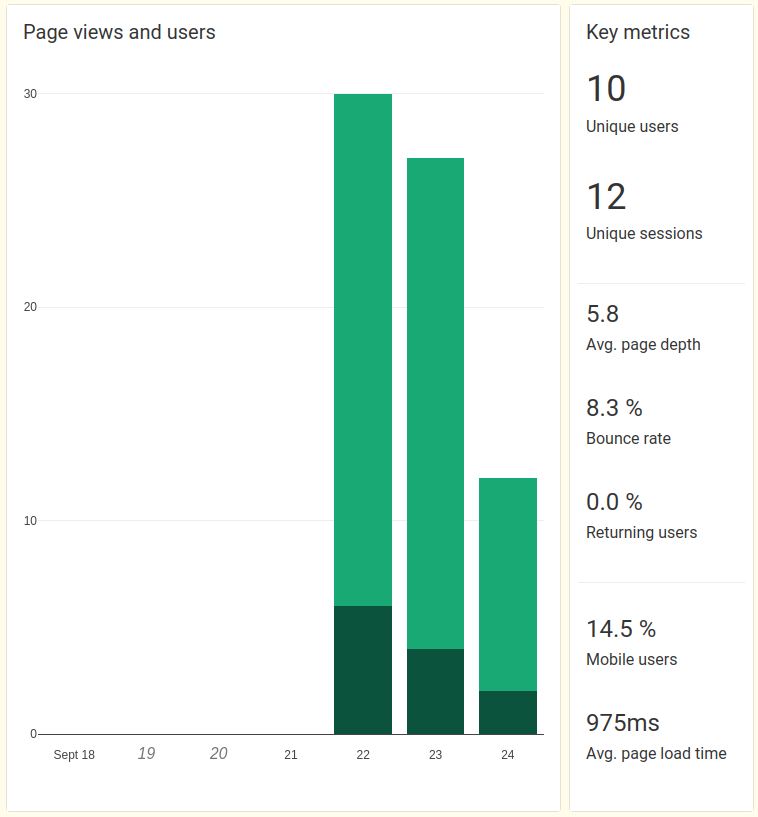
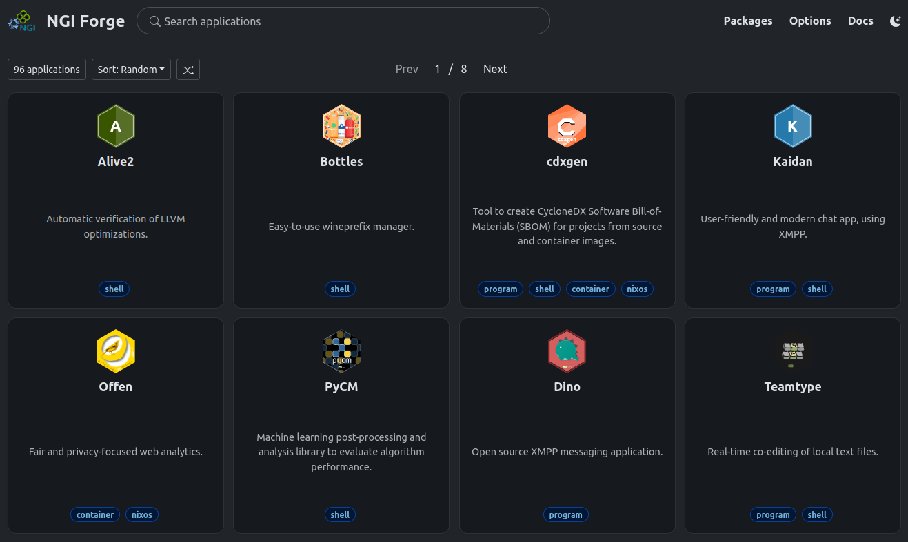
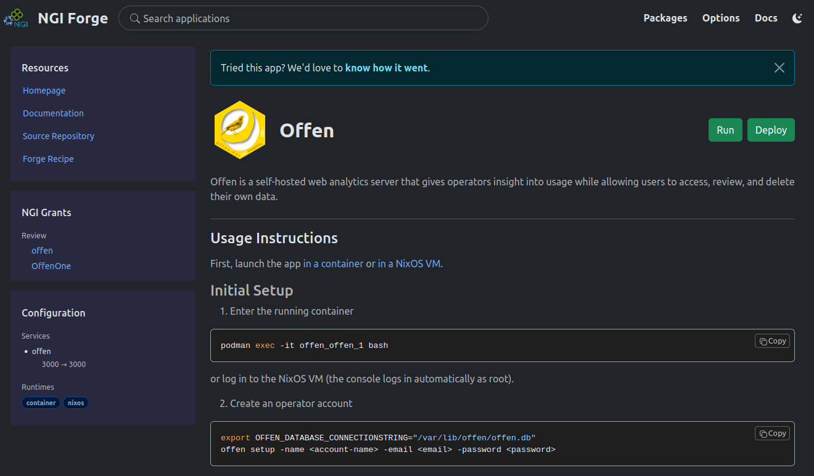
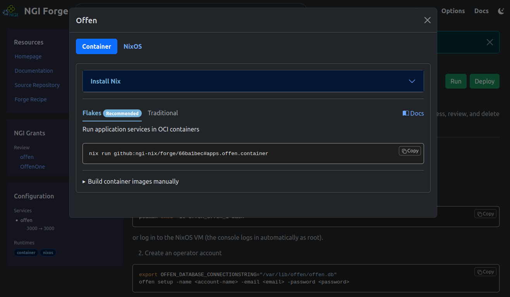
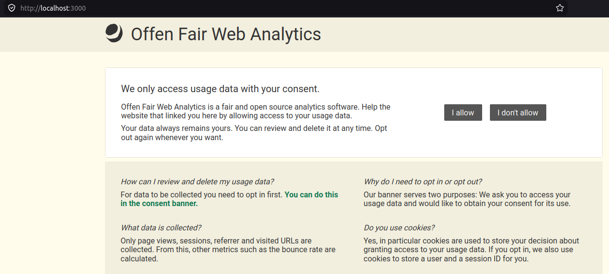
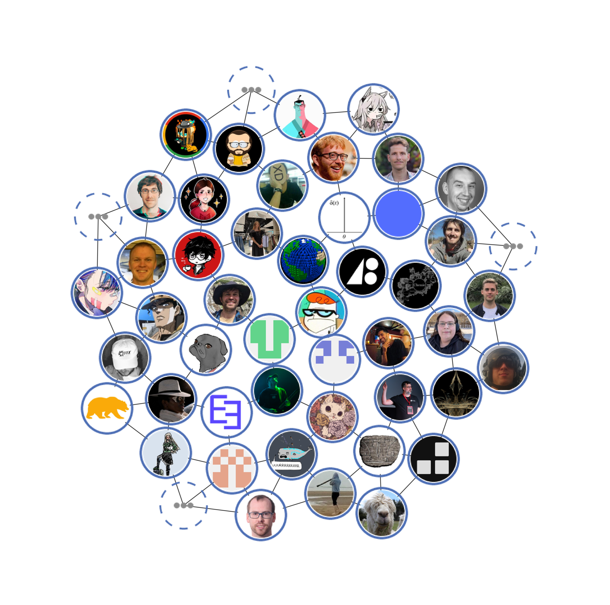
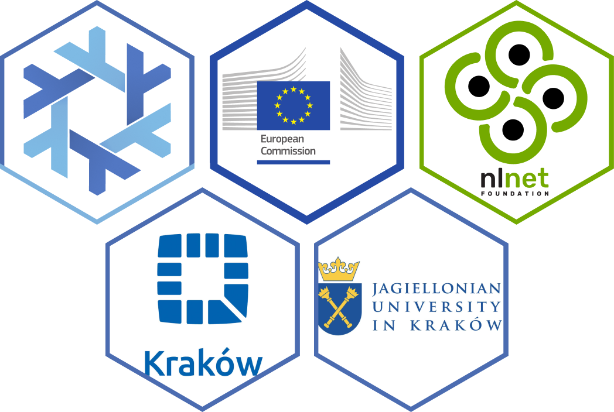

# NGI Forge
## Software Distribution Platform for NGI projects

NixCon 2026, Kraków, Poland

<font size=5>
Nix@NGI Team presented by Ivan Mincik (@imincik)
</font>

Note:
* Ivan leading the team since Nov 2025 ?

---

## Intro

---

### NGI (Next Generation Internet) program

**Internet of Humans** - **trust**, **security**, and **inclusion** and
other values and norms that we enjoy in Europe.


https://www.ngi.eu/about/

Note:
* Ongoing, will be replaced by Open Internet Stack

---

### NGI Zero

An **consortium** of not-for-profit organisations from across Europe.


https://www.ngi.eu/ngi-projects/ngi-zero/

---

### NLnet Foundation

NGI Zero **consortium leader**.

1000+ funded free software projects (1800+ cascading grants)


https://nlnet.nl/

---

### NixOS Foundation

NGI Zero **consortium member**.


https://nixos.org/

---

### NGI Team @ NixOS Foundation

<div style="display: flex; align-items: center; gap: 30px;">
<div style="width: 500px;">

</div>

<div style="text-align: left;">

NixOS Foundation deliverables:

* 1. **Package** and **maintain** all **NGI-funded projects** with Nix

* 2. Organize **Summer of Nix**

</div>
</div>

https://nixos.org/community/teams/ngi/

Note:
* Impossible task

---

## Our Challenges

---

### #1
**How to package** 1000+ projects with varying complexity, maturity, and ecosystem support?

---

### #2
**How to** sustainably **maintain** 1000+ projects?

---

## The Idea

---


**Attract upstream developers/contributors** and **distribute** the packaging and maintenance effort.

---

## NGI Forge



Note:
Forge development has started in Feb 2026
Version: 0.2

---

### Key Design Principles

* Make packaging of software **intuitive**

* Provide **attractive additional benefits** for contributors

* Target **wide range (also non-Nix) of users**

* **Gradually expose** users/contributors to the super-powers of Nix

Notes:
* Intuitive
  - easy to run software
  - packaging config makes sense to general software devs
* Attractive
  - rich software catalogue
  - additional features for contributors


---

### Features

* Build software into **packages**

* Compose **applications** for multiple **runtimes**

  * Programs (CLIs, GUI): **program** and **shell**

  * Services: **container** and **NixOS**

Note:
* Packages: like Nixpkgs
* Applications: like NixOS application modules

---


### Building packages and applications

Note:
* Modules system for packaging (recipe files)

---

### Offen - Fair Web Analytics

<div style="display: flex; align-items: center; gap: 30px;">
<div style="width: 600px;">

</div>

<div style="text-align: left;">

* 55 % Javascript + 40 % Go

* NGI0 PET 2019 - 2019
* NGI0 Discovery 2020 - 2022

* https://github.com/offen/offen

</div>
</div>

---

### Packages

`recipes/pkgs/offen/recipe.nix`

```nix
  pkgs.offen = {
    # package configuration
    # ...
  };
```
---

#### Metadata and Source

```nix [2-5|7-10]
  pkgs.offen = {
    version = "1.4.2-unstable-2026-06-11";
    description = "Fair and privacy-focused web analytics.";
    homePage = "https://www.offen.dev";
    mainProgram = "offen";

    source = {
      git = "github:offen/offen/ec99082a37ffb5855bd84debfef227d41c7b403c";
      hash = "sha256-EGlqD3611sG3YTVe74H49PB8Hj1NsKYhLANg5VAQ0wg=";
    };
  };
```

---

#### Package Builder

<div style="display: flex; align-items: center; gap: 30px;">
<div style="width: 950px;">

```nix [4-9]
  pkgs.offen = {
    # ...

    build.goPackageBuilder = {
      enable = true;
      vendorHash = "sha256-AeQa5oaOEB/50aPCRq702vMEtEctwP+jU5C6zB+3XR0=";
      ldflags = [ "-s" "-w" ];
      modRoot = "server";
    };
  };
```

</div>

<div style="text-align: left;">

* `npmPackageBuilder`
* `pythonAppBuider`
* `pythonPackageBuider`
* `rustPackageBuilder`
* `standardBuilder`

</div>
</div>

---

#### Test

```nix [3-6]
  pkgs.offen = {
    # ...

    test = {
      script = "offen --help | grep <something>";
      runner = "bash"; # or nixos
    };
  };
```

---

#### Build and test the package

<div style="text-align: left;">

<font size=6>Build package</font>
```plaintext
  nix build .#pkgs.offen
```

<font size=6>Run test</font>
```plaintext
  nix build .#pkgs.offen.test
```

</div>

---

#### Interactive package debugging

```nix
  build.debug = true;  # recipes/pkgs/offen/recipe.nix
```

```plaintext [1|3-5]
  nix develop .#pkgs.offen

  >>> Phase:  **unpackPhase** patchPhase updateAutotoolsGnuConfigScriptsPhase configurePhase buildPhase ...
  >>> Command:  runPhase unpackPhase
  >>> Press ENTER to run, CTRL-C to exit
```
---

### Applications

`recipes/apps/offen/recipe.nix`

```nix
  apps.offen = {
    # application configuration
    # ...
  };
```
---

#### Metadata

```nix [2-11]
  apps.offen = {
    displayName = "Offen";
    description = "Fair and privacy-focused web analytics.";
    longDescription = ''
      Offen is a self-hosted web analytics server that gives operators insight
      into usage while allowing users to access, review, and delete their own
      data.
    '';
    usage = ''
      ...
    ''
  };
```

---

#### Services

```nix [3-4|5-6|7|8-10|13-16]
  apps.offen = {
    # ...

    services = {
      components.offen = {
        process.command = pkgs.offen;  # <-- Forge package
        process.argv = [ "serve" ];
        process.environment = {
          OFFEN_SERVER_PORT = "3000";
        };
      };

      runtimes = {
        container.enable = true;
        nixos.enable = true;
      };
    };
  };
```

Note:
Using NixOS modular services

---

#### Test

```nix [4-6]
  apps.offen = {
    # ...

    test.services.script = ''
      curl localhost:3000 | grep "Offen Fair Web Analytics"
    '';
  };
```

<div style="text-align: left;">
<font size=6>Run test</font>

```plaintext
  nix build .#apps.offen.test
```
</div>

---

#### Run a service in bubblewrap

```plaintext [1|3-13]
  nix run .#apps.offen.services.offen

  [2026-09-22T07:50:45Z INFO  nimi::cli] Launching process manager...
  [2026-09-22T07:50:45Z INFO  nimi::process_manager] Starting process manager...
  [2026-09-22T07:50:45Z INFO  offen] Environment: OFFEN_DATABASE_CONNECTIONSTRING=/var/lib/offen/offen.db
  [2026-09-22T07:50:45Z INFO  offen] Environment: OFFEN_DATABASE_DIALECT=sqlite3
  [2026-09-22T07:50:45Z INFO  offen] Environment: OFFEN_SERVER_PORT=3000
  [2026-09-22T07:50:45Z INFO  offen] Environment: PATH=/nix/store/9394ss2hhwhslkvf9bva1sh8bl2v1ifa-nimi-0.1.0/bin:/nix/store/xjl7p8dvyk2j53kqf7f43kdj4ypbxz7g-coreutils-9.11/bin:/nix/store/2ndah67h0z5m31v2wkdmg2md4380ggr5-bash-interactive-5.3p15/bin:/nix/store/xjl7p8dvyk2j53kqf7f43kdj4ypbxz7g-coreutils-9.11/bin:/nix/store/xnjs6nb1rj4qvf0b1a1ck96g0n7l6rz3-offen-1.4.2-unstable-2026-06-11/bin
  [2026-09-22T07:50:45Z INFO  offen] Environment: PWD=/var/lib/offen
  [2026-09-22T07:50:45Z INFO  offen] Environment: SHLVL=0
  [2026-09-22T07:50:45Z INFO  offen] Environment: XDG_CONFIG_HOME=/tmp/nimi-config-44136fa355b3678a1146ad16f7e8649e94fb4fc21fe77e8310c060f61caaff8a
  [2026-09-22T07:50:45Z INFO  offen] XDG_CONFIG_HOME=/tmp/nimi-config-44136fa355b3678a1146ad16f7e8649e94fb4fc21fe77e8310c060f61caaff8a
  [2026-09-22T07:50:45Z INFO  offen] Running: /nix/store/xnjs6nb1rj4qvf0b1a1ck96g0n7l6rz3-offen-1.4.2-unstable-2026-06-11/bin/offen serve
```

---


### Web user interface

---

#### NGI applications catalogue



https://ngi.nixos.org/

Note:
TODO: update all screenshots

---

#### Offen



---

#### Run offen in container



---

#### Run offen in container

```plaintext [1|3-9]
nix run github:ngi-nix/forge/f00365b4#apps.offen.container

Creating container image /home/imincik/.cache/ngi-forge/e70cdb81/offen-offen-j3g9by1lj3mk3p9yclhzpbx15y9y36rr.tar ... done.
Loaded image: localhost/offen-offen:j3g9by1lj3mk3p9yclhzpbx15y9y36rr

[offen] | [2026-09-03T09:36:59Z INFO  nimi::cli] Launching process manager...
[offen] | [2026-09-03T09:36:59Z INFO  nimi::process_manager] Starting process manager...
[offen] | [2026-09-03T09:36:59Z INFO  offen] Running: /nix/store/hglbmavg7kjvpv36yy247dzms37xk53h-offen-1.4.2-unstable-2026-06-11/bin/offen serve
```



---


## Additional benefits

---

### Forge built-in package development environment

```plaintext
nix develop .#pkgs.offen.env
```

```bash
cp -r --no-preserve=mode,ownership
  /nix/store/agx01h4fykiwmy7p18w0a50rzpqhcg9n-source
  src

cd src/server

go build -o offen ./cmd/offen
```

```bash
./offen demo
```
---

### WIP: Benefits for upstream developers

<div style="text-align: left;">
Integrate Forge package
</div>

```bash
nix flake init --template github:ngi-nix/forge#developer
```

<div style="text-align: left;">
Launch development environment
</div>

```bash
nix develop
```

<div style="text-align: left;">
Run software from upstream repo
</div>

```plaintext
nix run github:<owner>/<repo>#package
```
---

### Nixpkgs


</br>
</br>

\> 300 packages maintained by NGI Team

Note:
* NGI software is either packaged in NGI Forge or in Nixpkgs
* Nixpkgs packages are re-exported as Forge apps

---

## How to contribute

* Matrix room
* GitHub project board

https://nixos.org/community/teams/ngi/

---

## Try yourself


https://ngi.nixos.org/

---

## Thank you

<div style="display: flex; align-items: center; gap: 10px;">
<div style="width: 700px;">

</div>

<div style="text-align: left;">



</div>
</div>

